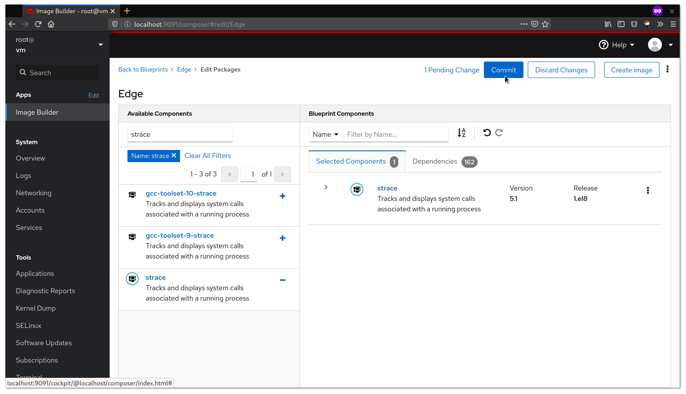
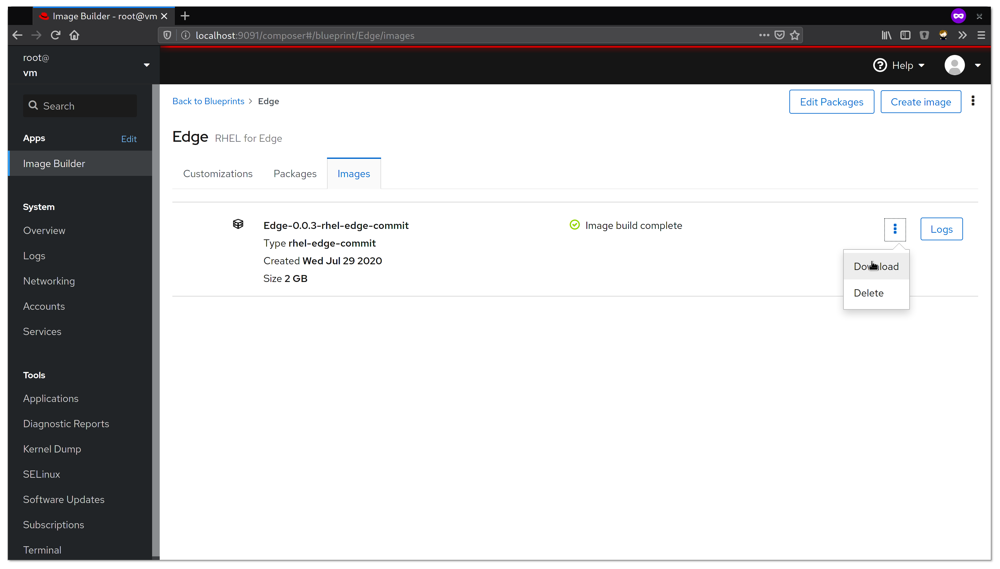
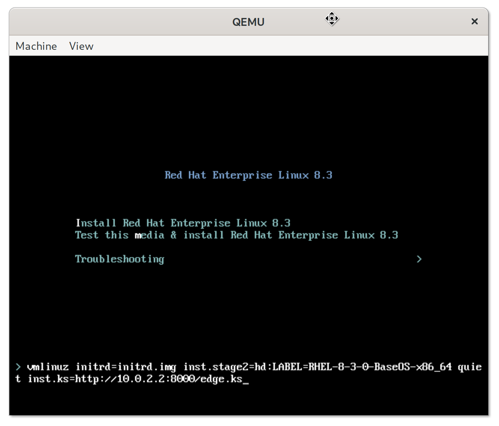

# RHEL for Edge with Image Builder Demo

## Requirements

Image Builder is available via [RHEL 8.3 Beta](https://access.redhat.com/products/red-hat-enterprise-linux/beta).
The *KVM Guest Image* is used to install Image Builder and build a
RHEL for Edge commit.
The *Boot ISO* is then used to install that commit.

Name            | Filename
----------------|---------------------------------
Boot ISO        | rhel-8.3-beta-1-x86_64-boot.iso
KVM Guest Image | rhel-8.3-beta-1-x86_64-kvm.qcow2


## Install Image Builder

### Run RHEL beta via VM script

A small helper script is used to start the RHEL 8.3 Guest Image. It uses
cloud init to provision a root use (password `r`). The script also enables
port forwarding for the ssh and web console ports (`22` → `2222` (host) and
`9090` → `9091`).

```
vm --persist rhel-8.3-beta-1-x86_64-kvm.qcow2
```

### Register the system

To be able to install packages the VM must be registered via:

```
subscription-manager register --username <redhat_login_username> --password <redhat_login_password>
subscription-manager role --set="Red Hat Enterprise Linux Server"
subscription-manager service-level --set="Self-Support"
subscription-manager usage --set="Development/Test"
subscription-manager attach
```

### Install Image Builder

```
yum install osbuild-composer cockpit-composer
```

### Enable web console
The Image Builder front end is a plugin to the web console (*cockpit*),
which needs to be enabled.
```
systemctl enable --now cockpit.socket
```

## Build a RHEL for Edge commit

Navigate to the web console via a browser on the host. URL: http://localhost:9091
There, *Image Builder* is found under *Apps* in the right menu.

 1. Activate the Image Builder service.
 2. Create a Blueprint 
 3. Add packages (optionally) 
 4. Create Image 
 5. **Wait**
 6. Tarball with the commit is ready to download 

## Inspect the commit

Extract the downloaded tarball via `tar xvf <uuid>-commit.tar`. It should
contain a `compose.json` and a `repo` directory. The former contains the
metadata about the commit, like the "Ref" (`ref`) and the commit id
(`ostree-commit`). The `repo` folder is a OSTree repository that contains
the commit.
The `ostree` and `rpm-ostree` commands can be used to inspect the contents:
The list of rpm packages included in the commit can be listed via
```
# print a list of packages in the commit
rpm-ostree db list rhel/8/x86_64/edge --repo=repo
```

## Install the commit

### Setup a webserver

In order to fetch the commit from the (generic) installer, it needs to be
served via HTTP. This can be done either via a small Go binary (`main.go`),
that can be run with:

```
go run main.go
```

Or a container can be prepared to serve the commit.

```
podman build -t httpd .
podman run --rm -p 8000:80 -v $(pwd):/var/www/html:Z httpd
```

### Install to a disk via Anaconda

The installer, anaconda, on the `boot.iso` installation medium is can
be used to install the commit. To configure the installer to use the
newly build commit, a "kickstart" configuration [`edge.ks`](edge.ks),
is used. It is setup for non-interactive, text-based installation.
The important line within the kickstart is the `ostreesetup` directive
which instructs the installer to fetch and deploy the commit.
Additionally a user `core` (pw: `edge`) is created.

For demonstration purposes we create an empty `qcow2` with a size of
`5G`, to act as the installation target:

```
qemu-img create -f qcow2 disk.qcow2 5G
```

The installer is run with qemu:
```
qemu-system-x86_64 \
  -m 2048 \
  -enable-kvm \
  -device virtio-net-pci,netdev=n0 \
  -netdev user,id=n0,net=10.0.2.0/24 \
  -drive file=disk.qcow2 \
  -cdrom rhel-8.3-beta-1-x86_64-boot.iso
```

To use the prepared kicksstart file, instead of the default one of
the `boot.iso`, an additional kernel parameter is needed (hit `TAB`
on the `Install ...` entry):

```
inst.ks=http://10.0.2.2:8000/edge.ks
```



As an alternative to supplying the kickstart location via the kernel
command line, the `mkksiso` (`lorax` package) can be used to inject
the kickstart file into the boot iso:

```
mkksiso edge.ks rhel-8.3-beta-1-x86_64-boot.iso boot.iso
```
